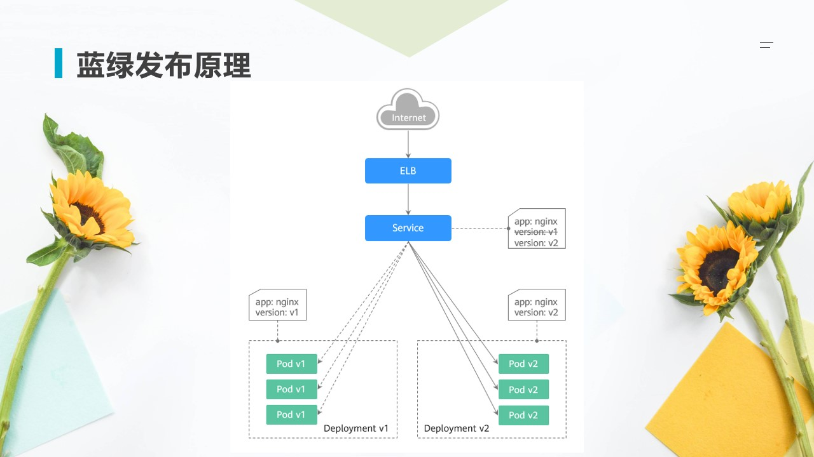
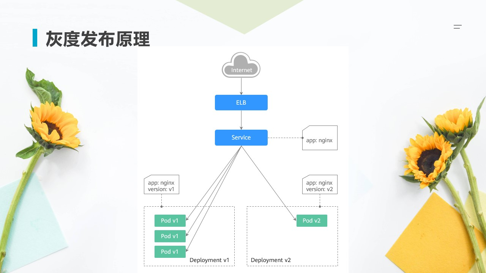
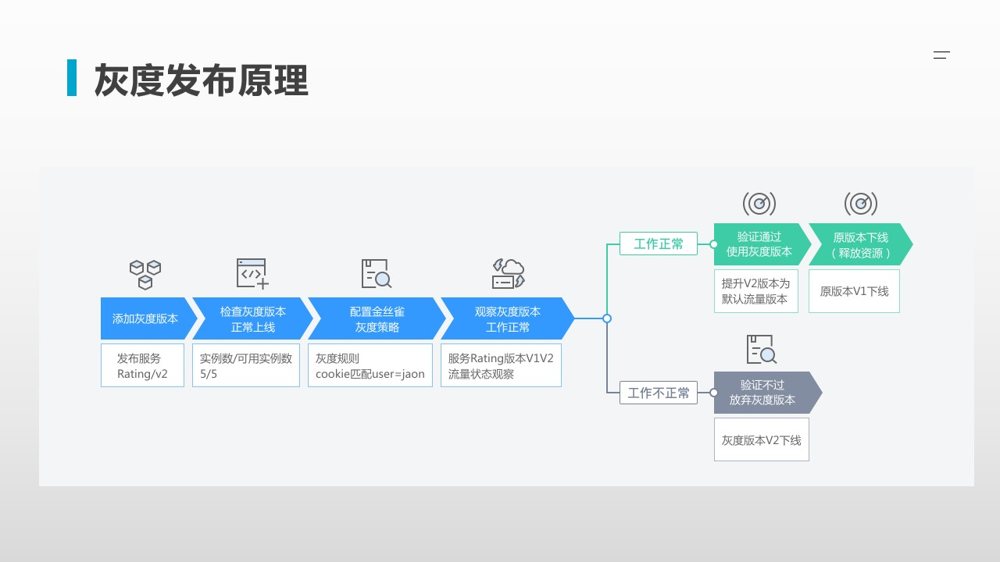
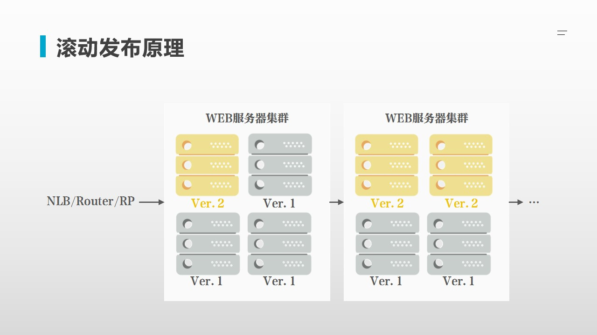
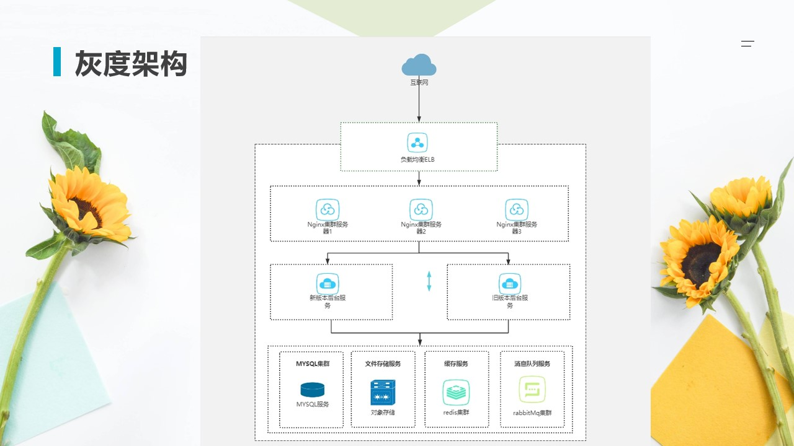

 

</br>


</br>
 

</br>
 

</br>


</br>
 

</br>


</br>
 

</br>
 

</br>
 

</br>
 

</br>

# 灰度发布

## 基于Nginx的灰度发布文档

灰度发布是一种重要的发布策略，允许我们在有限的用户群体中进行新版本的测试，从而减少对整个系统的影响。以下是基于Nginx实现灰度分流的步骤：

### 1. 安装和配置Nginx

确保已经安装了Nginx，并且其配置文件通常位于 `/etc/nginx/nginx.conf` 或 `/etc/nginx/conf.d/` 目录下。

### 2. 定义后端服务器

在Nginx配置文件中定义多个后端服务器。例如，一个用于旧版本，一个用于新版本：

```
http {
    upstream backend_old {
        server old_version_server_ip:port;
    }

    upstream backend_new {
        server new_version_server_ip:port;
    }

    ...
}

```

### 3. 配置灰度发布策略

可以通过Nginx的 `map` 指令来实现灰度分流。例如，根据特定的Cookie值来分流：

```
http {
    map $cookie_grayscale $backend {
        default backend_old;
        ~^new backend_new;
    }

    server {
        listen 80;

        location / {
            proxy_pass <http://$backend>;
        }
    }
}

```

在上述配置中，如果用户的 `cookie_grayscale` 包含 `new`，则请求会被转发到新版本的后端服务器，否则转发到旧版本的后端服务器。

### 4. 设置Cookie

在实际应用中，需要在用户访问时设置相应的Cookie。这可以通过Nginx的 `set_cookie` 指令实现，或者在应用层设置。

```
server {
    listen 80;

    location / {
        if ($arg_grayscale = "new") {
            add_header Set-Cookie "grayscale=new; path=/";
        }

        proxy_pass <http://$backend>;
    }
}

```

### 5. 测试和验证

配置完成后，重新加载Nginx配置：

```bash
nginx -s reload

```

访问应用，验证根据Cookie值是否正确进行分流。

### 总结

通过上述步骤，可以实现基于Nginx的灰度分流。可以根据实际需求调整分流策略，例如基于IP地址、请求头或其他参数进行分流。
